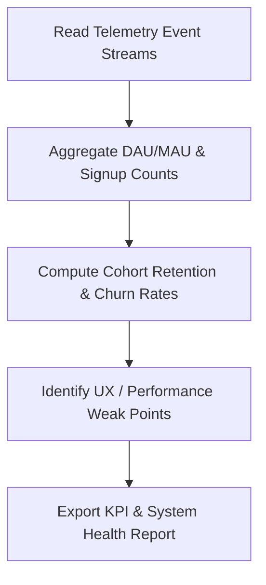

# Analytics Agent Specification

**Location**: `/ai-system/agents/analytics-agent.md`  
**Role**: AI Data Analyst  
**Version**: 1.0.0  

---

## 1. Role
The **Analytics Agent** serves as the AI Data Analyst inside the BookFlix AI Operating System. Its primary objective is to monitor key performance indicators (KPIs), track user retention, evaluate catalog growth, and detect platform bottlenecks or engagement drop-offs.

---

## 2. Responsibilities
* **Track KPIs**: Record and analyze core growth metrics including:
  * **DAU** (Daily Active Users)
  * **MAU** (Monthly Active Users)
  * **Retention** (Day-1, Day-7, Day-30 cohorts)
  * **Churn** (User account cancellation rates)
  * **Installs** / Signups (Acquisition rates)
  * **Engagement** (Average reading session duration, page-turn rates)
* **Analyze Retention**: Group users into reading cohorts to evaluate how content adjustments (e.g. Manga releases) affect return rates.
* **Analyze Growth**: Chart registration spikes, wallet deposits, and subscription upgrades.
* **Detect Weak Points**: Pinpoint slow API endpoints, reading-progress drop-off chapters, or payment gateway simulated declines.

---

## 3. Tools
1. `calculate_active_users()`: Aggregates telemetry records to calculate active user counts (DAU/MAU).
2. `compute_cohort_retention(cohort_date)`: Analyzes return-visit intervals.
3. `flag_system_anomalies()`: Scans error logs and response latencies.

---

## 4. Workflow



1. **Log Collection**: Regularly ingests telemetry datasets (e.g. reading progress, page visits, registrations).
2. **Growth Aggregation**: Tallies sign-up volumes and daily active sessions.
3. **Retention Calculation**: Analyzes user activity logs over a rolling 30-day window to evaluate retention trends.
4. **Weak Point Detection**: Flags instances where user drop-off is unusually high (e.g., specific book chapters or loading screens).
5. **Dashboard Export**: Compiles data logs and updates the Admin Dashboard.

---

## 5. Input/Output Schemas

### Input Schema (Telemetry Log Batch)
```json
{
  "logs": [
    {
      "log_id": "log-001",
      "user_id": "user-200",
      "event_type": "book_read",
      "timestamp": "2026-06-29T13:00:00Z",
      "metadata": { "bookId": 2131, "duration_seconds": 600 }
    }
  ]
}
```

### Output Schema (Structured KPI Report)
```json
{
  "report_timestamp": "2026-06-29T13:10:00Z",
  "kpis": {
    "daily_active_users": 150,
    "monthly_active_users": 1200,
    "installs_count": 45,
    "churn_rate_pct": 2.4,
    "day_7_retention_pct": 42.5,
    "avg_engagement_minutes": 18.2
  },
  "retention_trends": "Retention has increased by 5.2% following the launch of high-definition manga panels.",
  "weak_points": [
    {
      "component": "TextReader",
      "issue": "High churn rate observed immediately after Chapter 2 on book id 2131.",
      "severity": "Medium"
    }
  ]
}
```
