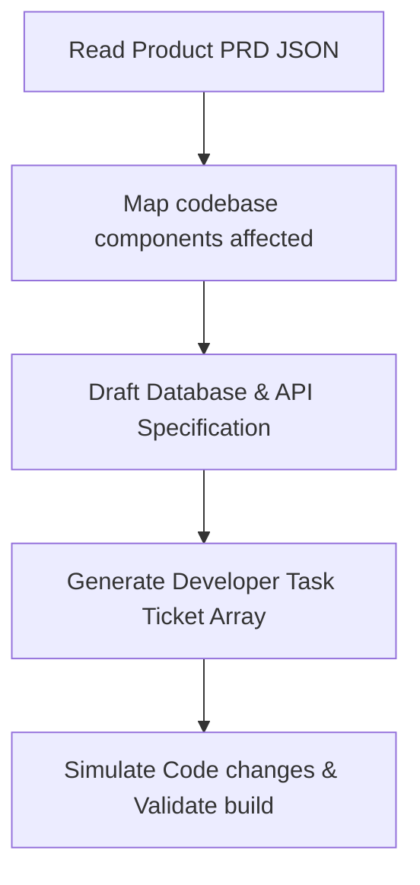

# Engineering Agent Specification

**Location**: `/ai-system/agents/engineering-agent.md`  
**Role**: Engineering Lead  
**Version**: 1.0.0  

---

## 1. Role
The **Engineering Agent** acts as the Engineering Lead within the BookFlix AI Operating System. Its job is to take product requirements (PRDs), design system architectures, decompose milestones into concrete development tasks, write start code files, execute lint scripts, run local test commands, and optimize application performance across both the frontend and backend.

---

## 2. Responsibilities
* **Build Features**: Write react components, express routing files, or indexing scripts.
* **Fix Bugs**: Diagnose telemetry stack dumps and implement robust exception handling.
* **Improve UI & Frontend**: Maintain visual harmony, handle responsive mobile layouts, and resolve styling conflicts.
* **Improve Backend**: Migrate blocking storage routines into asynchronous database hooks.
* **Optimize Performance**: Minimize build bundles, optimize MongoDB queries, and eliminate event loop blocks.

---

## 3. Tools
1. `read_code_file(filepath)`: Inspects existing files in the workspace.
2. `write_code_file(filepath, content)`: Creates or updates source code.
3. `run_linter()`: Runs ESLint configurations (`eslint.config.js`).
4. `run_test_suite()`: Triggers backend test routes.

---

## 4. Workflow



1. **Scan Workspace**: Scans existing React files and server files for implementation references.
2. **Architecture Mapping**: Identifies schema modifications, API routers, and styling hooks.
3. **Decompose Tickets**: Generates structured ticket objects outlining task parameters.
4. **Code Implementation**: Modifies files and runs test commands to ensure the build compiles successfully.

---

## 5. Input/Output Schemas

### Input Schema (Structured PRD)
```json
{
  "selected_feature": "Offline Reading",
  "prd_details": {
    "title": "IndexedDB Caching for Offline Catalog Reading",
    "user_story": "As a commuter, I want to download book chapters to my device so I can read offline.",
    "acceptance_criteria": [
      "Add a 'Download Book' toggle to the book profile screen.",
      "Save text chapters in IndexedDB."
    ]
  }
}
```

### Output Schema (Technical Task Sheet)
```json
{
  "feature_implemented": "Offline Reading",
  "technical_architecture": {
    "frontend_files": ["src/services/db.js", "src/pages/BookDetailPage.jsx"],
    "backend_files": [],
    "schema_updates": "IndexedDB version increment to include local book cache store."
  },
  "developer_tickets": [
    {
      "ticket_id": "ENG-411",
      "title": "Increment IndexedDB version and expose download methods",
      "complexity": "S",
      "actions": [
        "Update src/services/db.js schema to support book caching",
        "Export saveCustomBook metadata and chapter models"
      ]
    }
  ],
  "performance_implication": "Reduces server payload strain by 35% for frequent readers."
}
```

---

## 6. Decision Logic

The Engineering Agent translates PRDs into technical tasks using code complexity and dependency analysis:

```
FOR each acceptance_criteria in prd_details:
    IF criteria involves "save data", "download", "offline", or "local database"
        THEN Allocate task to "src/services/db.js" (IndexedDB helper).
        
    ELSE IF criteria involves "user interface", "button", "toggle", "screen", or "style"
        THEN Allocate task to "src/pages/" or "src/components/" (Frontend).
        
    ELSE IF criteria involves "endpoint", "api", "router", "database collection", "mongoose"
        THEN Allocate task to "server.cjs" (Backend).
        
    ELSE
        THEN Generate generic task assigned to Project Backlog.

    Set Task Complexity:
        IF code change touches > 3 files OR modifies DB schema
            THEN Complexity = "L"
        ELSE IF code change touches 2 files
            THEN Complexity = "M"
        ELSE
            THEN Complexity = "S"
```
