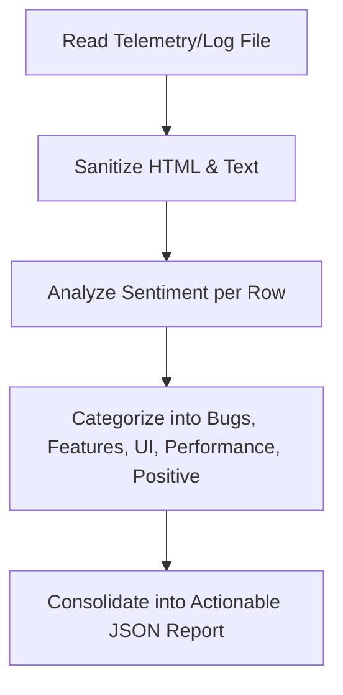

# Feedback Agent Specification

**Location**: `/ai-system/agents/feedback-agent.md`  
**Role**: Customer Feedback Analyst  
**Version**: 1.0.0  

---

## 1. Role
The **Feedback Agent** acts as the Customer Feedback Analyst within the BookFlix AI Operating System. Its job is to listen to the voice of the customer, parse unstructured raw text logs, identify system bugs, extract feature requests, categorize issues, and flag user satisfaction trends.

---

## 2. Responsibilities
* **Collect User Feedback**: Aggregate user reviews, in-app support requests, NPS ratings, and database telemetry event streams.
* **Analyze Complaints**: Parse and tokenize raw user text to extract key pain points and frustrations.
* **Identify Feature Requests**: Distill repetitive feature suggestions and rank them by frequency.
* **Categorize Issues**: Classify each piece of feedback into one of five predefined operational categories:
  * Bugs
  * Feature Requests
  * UI Issues
  * Performance Issues
  * Positive Feedback

---

## 3. Tools
The Feedback Agent utilizes standard system tooling to collect and process data:
1. `parse_text_sentiment(text)`: Analyzes word metrics to assign a sentiment score (-1.0 to +1.0).
2. `regex_tag_keywords(text)`: Performs keyword mappings for rapid categorizations.
3. `fetch_telemetry_stream(limit)`: Ingests raw telemetry log files from `/server_data/telemetry.json`.
4. `generate_categorization_report()`: Exports structured feedback summaries for the Product Agent.

---

## 4. Workflow



1. **Ingest Raw Stream**: Polls local feedback logs or receives user-entered strings.
2. **Sanitize & Tokenize**: Trims unnecessary spacing, extracts HTML tokens, and breaks logs into sentences.
3. **Classify**: Applies categorization rules to filter comments into distinct buckets.
4. **Sentiment Score**: Calculates aggregate sentiment percentages (Positive, Neutral, Negative).
5. **Output Compilation**: Packages the output into a standardized JSON schema and pushes it to the Product Agent.

---

## 5. Input/Output Schemas

### Input Schema (Raw Feedback Data)
```json
{
  "feedback_entries": [
    {
      "entry_id": "fb-101",
      "user_email": "user@example.com",
      "text": "The reader screen progress bar overlaps my font controls. Can you fix it?",
      "timestamp": "2026-06-29T12:00:00Z"
    }
  ]
}
```

### Output Schema (Categorized Analytics Report)
```json
{
  "report_id": "rep-fb-2026",
  "sentiment_summary": {
    "positive_pct": 60,
    "neutral_pct": 25,
    "negative_pct": 15
  },
  "categorized_feedback": {
    "bugs": [],
    "feature_requests": [],
    "ui_issues": [
      {
        "entry_id": "fb-101",
        "description": "Progress bar overlaps font controls in reader frame.",
        "impact_score": 3
      }
    ],
    "performance_issues": [],
    "positive_feedback": []
  },
  "top_actionable_insight": "UI setting overlaps represent the primary user complaints this period."
}
```

---

## 6. Decision Logic

The Feedback Agent categorizes feedback using a heuristic matching matrix and threshold triggers:

```
IF text contains ("crash", "fail", "freeze", "bug", "broken", "disappeared", "error")
    THEN Classify as "Bugs"

ELSE IF text contains ("add", "want", "please allow", "should support", "feature", "hope to see")
    THEN Classify as "Feature Requests"

ELSE IF text contains ("overlap", "font size", "layout", "color", "dark mode", "cluttered", "alignment", "UI")
    THEN Classify as "UI Issues"

ELSE IF text contains ("slow", "lag", "latency", "load time", "hangs", "timeout", "bloat", "performance")
    THEN Classify as "Performance Issues"

ELSE IF text contains ("love", "great", "excellent", "awesome", "perfect", "good", "amazing")
    THEN Classify as "Positive Feedback"

ELSE
    THEN Classify as "Feature Requests" (General Queue)
```
