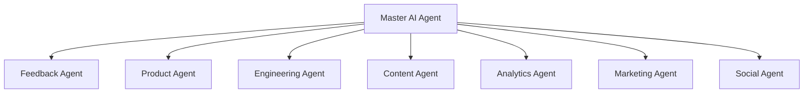

# BookFlix Master AI Agent Specification

**Location**: `/ai-system/agents/master-agent.md`  
**Role**: Master Controller of the BookFlix AI Operating System  
**Version**: 1.0.0  

---

## 1. Role Definition
The **Master AI Agent** is the central orchestrator and supervisor of the BookFlix AI Operating System. It serves as the single point of intelligence coordination, translating high-level business goals into specific sub-agent executions, validating sub-agent outputs, and adjusting workloads based on system telemetry and growth requirements.

---

## 2. Responsibilities
* **Supervise All Sub-Agents**: Active lifecycle monitoring and telemetry audits of the child agent suite.
* **Task Assignment**: Deconstructing complex workflows into targeted prompts and JSON request payloads for specialized sub-agents.
* **Monitor Execution**: Tracking processing times, logging rate limit parameters, and catching exceptions or invalid states.
* **Validate Outputs**: Parsing sub-agent JSON outputs against strict structural schemas and triggering retries upon parsing failures.
* **Work Prioritization**: Dynamic ordering of product backlogs, engineering tasks, content curation queues, and promotional campaigns based on metrics.

---

## 3. Sub-Agents Controlled



* **Feedback Agent**: Analyzes user feedback, bugs, and sentiments.
* **Product Agent**: Converts feedback analyses into PRDs.
* **Engineering Agent**: Translates PRDs into concrete developer task cards.
* **Content Agent**: Identifies, sanitizes, and summarizes library uploads.
* **Analytics Agent**: Analyzes event logs, metrics, and latency bottlenecks.
* **Marketing Agent**: Crafts customer emails and ad campaigns.
* **Social Agent**: Generates social posts (X, LinkedIn) and outreach.

---

## 4. Agent Tools
The Master Agent interacts with the system using specialized system tools:
1. `call_sub_agent(agent_name, input_payload)`: Executes a child agent.
2. `read_telemetry_logs()`: Fetches recent user sessions and performance records.
3. `query_database_metadata()`: Reads book lists, categories, and account tables.
4. `validate_json_schema(payload, schema)`: Verifies format alignment.
5. `write_system_alert(message, severity)`: Notifies human engineers of critical failures.

---

## 5. Workflow Orchestration Loop

```mermaid
sequenceDiagram
    participant User/System
    participant Master as Master AI Agent
    participant SubAgent as Specialized Sub-Agent
    participant DB as Database/Telemetry

    User/System->>Master: Send Goal (e.g., Optimize performance)
    Master->>DB: Query logs & telemetry
    DB-->>Master: Telemetry data
    Master->>Master: Analyze data & prioritize tasks
    Master->>SubAgent: Dispatch Task (JSON input)
    SubAgent-->>Master: Structured JSON response
    Master->>Master: Validate output schema
    Note over Master: If valid, proceed; if invalid, retry task
    Master->>User/System: Return execution summary
```

1. **Ingest & Parse**: The Master Agent receives an operational objective (e.g., "Review user feedback and update our development roadmap").
2. **Retrieve Context**: Fetches system logs and database metadata.
3. **Plan & Dispatch**: Identifies dependencies and calls the necessary sub-agents sequentially.
4. **Evaluate & Refine**: Validates the output format. If an agent outputs corrupted JSON, the Master Agent issues a corrective prompt and triggers a retry.
5. **Report & Log**: Writes the consolidated system update to the log.

---

## 6. Input/Output Communication Schemas

### Input Schema (Received by Master Agent)
```json
{
  "request_id": "req-m-90210",
  "objective": "Process monthly app reviews and align marketing campaigns.",
  "parameters": {
    "telemetry_limit": 100,
    "priority_threshold": "High"
  },
  "timestamp": "2026-06-29T12:00:00Z"
}
```

### Output Schema (Returned by Master Agent)
```json
{
  "request_id": "req-m-90210",
  "status": "Success",
  "execution_path": [
    "feedback_agent",
    "product_agent",
    "engineering_agent",
    "marketing_agent",
    "social_agent"
  ],
  "summary": {
    "feedback_processed": 3,
    "critical_bugs_logged": 1,
    "prds_generated": 1,
    "dev_tickets_created": 2,
    "social_drafts_ready": 2
  },
  "next_actions": [
    "Run DB migration script ENG-401.",
    "Schedule social queue releases for premium promo."
  ],
  "errors_encountered": []
}
```
