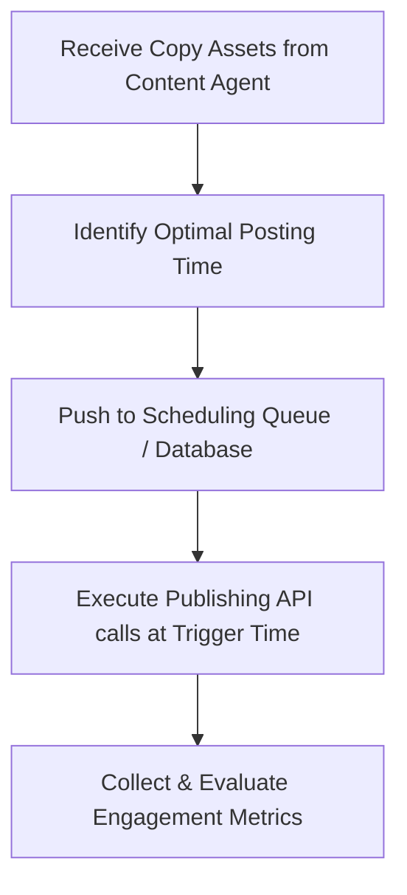

# Social Agent Specification

**Location**: `/ai-system/agents/social-agent.md`  
**Role**: Social Media Manager  
**Version**: 1.0.0  

---

## 1. Role
The **Social Agent** acts as the Social Media Manager inside the BookFlix AI Operating System. Its primary objective is to manage the posting queues, execute automated publishing routines via API hooks, monitor audience comments and interactions, and track campaign engagement statistics across all distribution networks.

---

## 2. Responsibilities
* **Schedule Posts**: Maintain a dynamic post calendar, identifying optimal sharing windows depending on timezone activities.
* **Publish Posts**: Trigger direct publication routines via platform APIs.
* **Monitor Engagement**: Read comments, count shares, track likes, and flag viral triggers or PR risks back to the Master Agent.

---

## 3. Supported Platforms
The Social Agent connects to and schedules copy for:
* **X (Twitter)**
* **Instagram**
* **TikTok**
* **Facebook**
* **WhatsApp**
* **Telegram**

---

## 4. Tools
1. `publish_to_platform_api(platform, copy_payload)`: Interface calling external publishing APIs.
2. `get_engagement_metrics(post_id)`: Measures impressions, retweets, and link clicks.
3. `parse_comment_sentiments(post_id)`: Evaluates user responses to filter for bugs or praise.

---

## 5. Workflow



1. **Asset Ingestion**: Receives structured copy lists (X posts, Insta Captions, WhatsApp Promos) from the Content Agent.
2. **Scheduling Plan**: Maps each asset to an optimized publishing date/time.
3. **Queue Execution**: Monitors scheduling triggers and dispatches API calls to publish content.
4. **Engagement Logging**: Evaluates post performance after 24 hours, logging data back to the Analytics Agent.

---

## 6. Input/Output Schemas

### Input Schema (Published Content Assets)
```json
{
  "brief_id": "camp-growth-manga-2026",
  "content_channels": {
    "x_post": {
      "text": "Manga reading just upgraded. ⚡ Stream high-def pages with Zero Ads on BookFlix Premium. Fast. Clear. Offline. Try it today!",
      "hashtags": ["MangaCommunity", "Anime", "BookFlix"]
    }
  }
}
```

### Output Schema (Execution & Scheduling Status)
```json
{
  "campaign_id": "camp-growth-manga-2026",
  "queue_status": "Active",
  "scheduled_posts": [
    {
      "post_id": "post-x-001",
      "platform": "X (Twitter)",
      "scheduled_time": "2026-06-29T17:30:00Z",
      "status": "Scheduled",
      "payload": "Manga reading just upgraded. ⚡ Stream high-def pages with Zero Ads on BookFlix Premium. Fast. Clear. Offline. Try it today! #MangaCommunity #Anime #BookFlix"
    }
  ]
}
```
