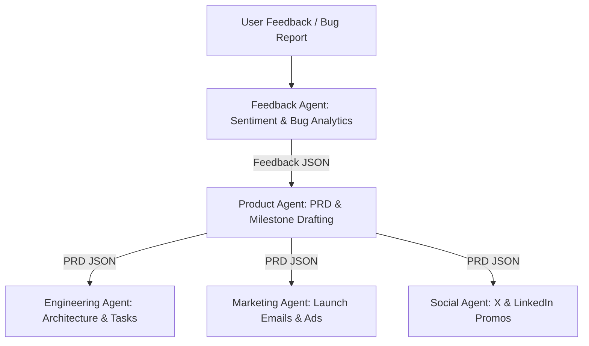

# BookFlix AI Operating System Architecture Documentation

**Location**: `/ai-system/docs/architecture.md`  
**Classification**: System Design Spec / Technical blueprint  

---

## 1. Overview
The BookFlix AI Operating System is a production-grade multi-agent execution environment built inside the BookFlix codebase. It leverages specialized, single-responsibility agents that collaborate via a Master Coordinator to automate user feedback analysis, draft product requirement documents, generate developer tickets, ingest classic literature, monitor platform telemetry, and execute growth campaigns.

---

## 2. Directory Layout and Folder Breakdown

```
/ai-system
│
├── agents/         # Modular Python-based agent implementations extending BaseAgent
│   ├── base_agent.py        # Abstract blueprint with prompt loading and mock fallback
│   ├── feedback_agent.py    # Analyzes customer reviews, bug reports, and sentiment
│   ├── product_agent.py     # Compiles feedback reports into structured PRDs
│   ├── engineering_agent.py # Translates PRDs into concrete developer task lists
│   ├── content_agent.py     # Indexes uploaded text assets, tags and summarizes
│   ├── marketing_agent.py   # Drafts user acquisition emails and ad campaign copy
│   ├── social_agent.py      # Prepares engaging social copy (X, LinkedIn)
│   ├── analytics_agent.py   # Diagnoses telemetry log events and latency issues
│   └── master-agent.md      # Specification and role description for the Master Agent
│
├── prompts/        # Plain text system prompts separating instructions from code
│   ├── feedback_agent.txt
│   ├── product_agent.txt
│   ├── engineering_agent.txt
│   ├── content_agent.txt
│   ├── marketing_agent.txt
│   ├── social_agent.txt
│   └── analytics_agent.txt
│
├── workflows/      # Multi-agent pipelines, coordinator scripts, and system config
│   ├── config.py            # Loads keys, models, and selects LLM vs mock provider
│   └── coordinator.py       # Orchestrates sequential and concurrent agent flows
│
└── docs/           # Specifications, audits, and architectural blueprints
    ├── architecture.md      # System layout and developer guide (This File)
    └── audit-report.md      # Complete architectural audit of the BookFlix codebase
```

### Folder Roles
1. **`/ai-system/agents`**: Houses executable Python classes representing individual agents. They are designed following single-responsibility principles. All agents extend a unified base lifecycle.
2. **`/ai-system/prompts`**: Holds version-controlled prompt files. Separating prompt templates from Python files ensures instructions can be refined and deployed without code updates.
3. **`/ai-system/workflows`**: Implements coordinator and orchestrator pipelines. This directory binds agents into loops (such as feeding feedback logs to product planning and then engineering).
4. **`/ai-system/docs`**: Contains architectural diagrams, system blueprints, audits, and guides.

---

## 3. Core Multi-Agent Orchestration Flow

The system runs on the **Master AI Agent** specification and executes workflows via `coordinator.py`.



### Pipeline Details
* **Feedback-to-Task Pipeline**: Ingests raw reviews, identifies database lock warnings or reader settings overlap, creates a PRD, generates developer ticket IDs (`ENG-401`, `ENG-402`), and pre-composes marketing and social copy for the release.
* **Content Ingest Pipeline**: Triggered on book uploads. Runs NLP analysis, designs summary hooks, extracts tags, and compiles social media announcements.

---

## 4. Execution and Testing Guide

### Prerequisites
1. Ensure Python 3.8+ is installed.
2. Set API keys inside environment variables to use real LLM backends (defaults to `mock` execution mode):
   ```bash
   # Windows PowerShell
   $env:AI_PROVIDER="gemini" # or "openai"
   $env:GEMINI_API_KEY="AIzaSyYourKeyHere..."
   ```

### Run the Coordinator Demo
Execute the orchestrator to verify the multi-agent pipeline:
```bash
python ai-system/workflows/coordinator.py
```

### Run Individual Agent Tests
Verify individual agent configurations:
```bash
python ai-system/agents/feedback_agent.py
python ai-system/agents/content_agent.py
```

---

## 5. Scaling for Future Growth
* **Decoupling with Queues**: Future updates should map sub-agents to separate message queues (e.g. RabbitMQ/Celery) so that parsing and summarization do not run in the web application's main thread.
* **Tool Bindings**: Additional API access can be added to `base_agent.py` to allow agents to interact directly with the MongoDB database or S3 storage buckets.
