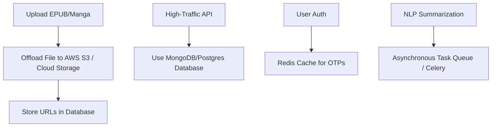

# BookFlix Codebase Architecture Audit Report

**Date**: June 29, 2026  
**Auditor**: Senior AI Systems Architect  
**Project**: BookFlix  
**Classification**: Confident / Internal Technical Specs  

---

## Executive Summary
This report presents a detailed architectural audit of the BookFlix codebase. While the application implements a rich feature set (including EPUB parsing, Web Speech TTS, AI summaries, and dynamic catalogs), it suffers from severe architectural risks that will prevent production-grade scale. The most critical issue is the reliance on a monolithic JSON-based flat file database fallback that blocks Node.js events and risks catastrophic data corruption.

---

## 1. Strengths

* **Offline-Ready Client Storage**: The use of IndexedDB (`src/services/db.js`) on the frontend to manage custom EPUB uploads locally is a solid design pattern. It allows users to read self-published books without wasting backend bandwidth.
* **Feature Richness**: The reader supports advanced client capabilities such as local speech synthesis (Web Speech API), custom font controls, multiple themes, and rule-based AI summaries.
* **Smooth UI Aesthetics**: Interactive panels use `framer-motion` for transitions, providing fluid and responsive animations that align with modern streaming design guidelines.
* **Double-Layer Database Abstraction**: The backend includes an abstraction layer (`db`) in `server.cjs` that switches transparently between MongoDB (Mongoose models) and disk-bound JSON files, facilitating easy staging/local development without database setups.
* **Ingestion Automation**: The root directory contains numerous helper scripts (`add_fallback_books.py`, `add_final_gutenberg_books.py`, etc.) representing structured data pipelines for importing and cleaning content.

---

## 2. Weaknesses

* **Monolithic Global Stylesheet**: The styling relies entirely on `src/index.css` (49KB), which contains thousands of lines of vanilla CSS. The absence of a design system framework makes styling modifications error-prone and leads to style regressions.
* **State Syncing Overlap**: State is managed in `AuthContext` and `BookContext` but shares logic (e.g. JWT headers and local storage calls), leading to duplicated logic.
* **Synchronous EPUB Parsing**: EPUB extraction and layout processing happen synchronously inside the main Express thread. Parsing complex zip binaries blocks concurrent incoming requests.
* **Single-Point-Of-Failure System Configs**: Operational configs, transaction history, and telemetry logs reside in flat files inside `server_data/` by default. Under load, multiple write handles will crash the system.

---

## 3. Urgent Problems

### 🚨 Blocking Flat-File DB Operations (Critical Performance Bottleneck)
In local JSON database mode, every read or write requires reading and writing files synchronously or using blocking calls. For example, `book_contents.json` (containing the chapters of all books) has bloated to **22MB**.
Whenever a user uploads a book, updates progress, or fetches a chapter:
1. Node.js reads the entire 22MB file from disk into memory.
2. The JSON parser parses it.
3. The server mutates the object.
4. The server stringifies the object.
5. The server overwrites the entire file on disk.

This blocks the single-threaded Node.js event loop for several hundred milliseconds per request, causing massive latencies and preventing scaling.

### 🚨 Concurrency Collisions & Data Loss
Because there is no file locking mechanism, concurrent operations on JSON databases will result in silent overrides. If User A updates their reading progress at the exact moment User B uploads a book, the file handle that finishes writing last will overwrite the other's modifications.

### 🚨 Base64 Graphic Media Storage
The Mongoose schema and JSON structures store comic and manga frames as `imageBase64` strings inside the database records. If a manga has 50 pages, it will add 40-50MB of raw text strings to `book_contents.json`, leading to memory exhaustion and database timeout exceptions.

### 🚨 Stateful Authentication Constraints (In-Memory OTP maps)
The OTP codes for registration and password resets are kept in-memory:
```javascript
const signupOTPMap = new Map();
const resetOTPMap = new Map();
```
If the server crashes, restarts, or is load-balanced across multiple instances, user registration states are lost, and users cannot verify their credentials.

---

## 4. Feature Gaps

* **Missing Real Payment Gateway**: The wallet and withdrawal simulator uses fake payment buttons and mock API routines. No real payment processing is integrated.
* **No PDF Viewport**: Textbooks and research papers are parsed as raw EPUB paragraphs, losing mathematical formulas, code blocks, and layouts.
* **No Pagination in Search / Feed Rows**: The server returns all books in one array. When the catalog reaches thousands of books, the app will experience memory issues.
* **No Offline Sync for Catalog Books**: While custom uploads are stored in IndexedDB, library catalog books cannot be downloaded for offline viewing.

---

## 5. UI/UX Issues

* **Settings Panel Collision**: In `TextReader.jsx`, the font-size settings overlap the reading progress bar, obstructing visibility on smaller viewports.
* **State Jump on Theme Toggle**: Toggling between dark, light, and sepia modes causes flash transitions on some elements due to un-themed React components.
* **Verbose Admin Dashboard**: The admin dashboard is cluttered with telemetry grids and forms, making it difficult to use on tablet and mobile viewports.

---

## 6. Recommended Improvements



### Architectural Upgrades
1. **Enforce MongoDB in Production**: Completely disable JSON database files in production environments. Move to a relational or document database.
2. **Move Assets to Cloud Storage**: Instead of storing base64 manga frames in the database, upload manga images and book covers to a cloud storage bucket (e.g., AWS S3, Google Cloud Storage) and save only the URLs in the database.
3. **Decouple OTPs with Redis**: Move sign-up and reset caches into a shared Redis instance to support stateless horizontal scaling.
4. **Implement Pagination**: Update `/api/books` and the search handlers to accept page offsets (`?limit=20&page=1`).
5. **Offload NLP Summarization**: Run the extractive summaries and NLP tokenizations on background workers (or execute them via asynchronous task managers) instead of blocking the main thread.
