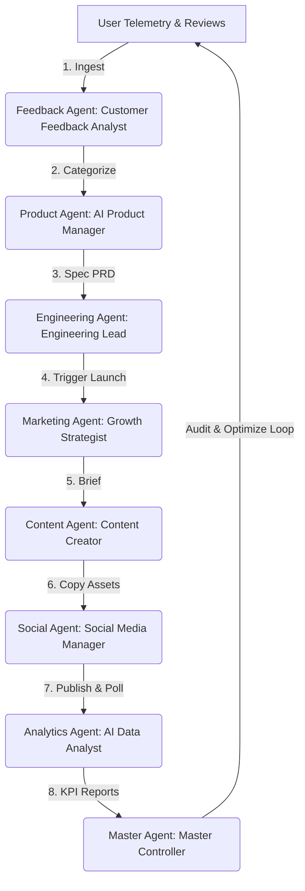

# BookFlix AI Operating System: Master Workflow Integration

**Location**: `/ai-system/workflows/master-workflow.md`  
**Pipeline**: Feedback $\rightarrow$ Product $\rightarrow$ Engineering $\rightarrow$ Marketing $\rightarrow$ Content $\rightarrow$ Social $\rightarrow$ Analytics $\rightarrow$ Master Agent  
**Version**: 1.0.0  

---

## 1. Full Architecture
The BookFlix AI Operating System (AI OS) integrates all 8 agents into a unified, self-improving automation loop. This loop continuously ingests user behaviors, prioritizes features, builds specifications, generates promotional campaigns, publishes social copy, monitors platform engagement, and reports directly to the Master Agent supervisor.



---

## 2. Master Workflow
The system runs in a continuous loop:
1. **Feedback Aggregation**: Collects user comments, identifying pain points like database file lock warning bottlenecks or visual setting overlaps.
2. **Product Requirement Design**: Evaluates the prioritized issues to construct feature specs (PRDs).
3. **Engineering Specifications**: Translates user requirements into developer tickets and codebase maps.
4. **Marketing Launch Strategy**: Schedules ad-copy campaign plans for the upcoming features.
5. **Content Asset Generation**: Brainstorms viral hooks and drafts copy for X, Instagram, TikTok, and WhatsApp.
6. **Distribution & Delivery**: Schedules and publishes social copy at peak user transit hours.
7. **Performance Analytics**: Monitors DAU, MAU, signups, churn, and link CTRs.
8. **Master Agent Audit**: Reviews KPI reports, validates sub-agent outputs, and re-allocates budgets to optimize the entire cycle.

---

## 3. Execution Order

The execution sequence is structured as follows:

| Step | Agent | Input | Output | Role |
| :--- | :--- | :--- | :--- | :--- |
| **1** | **Feedback Agent** | Raw Telemetry & Reviews | Categorized Sentiment & Bugs | Analyzes customer sentiment and flags issues. |
| **2** | **Product Agent** | Categorized Bugs & Requests | PRDs & Roadmap Backlog | Compiles feature specs and prioritizes roadmap. |
| **3** | **Engineering Agent** | Structured PRD | Tech Specs & Task Tickets | Maps affected code files and creates tickets. |
| **4** | **Marketing Agent** | Core Product Goals | Growth Campaigns Brief | Plans acquisition channels and targeting. |
| **5** | **Content Agent** | Campaign Brief | Social Copies & Viral Hooks | Generates marketing copy for multiple channels. |
| **6** | **Social Agent** | Formatted Social Copy | Scheduling & Posting Logs | Schedules and publishes posts at peak times. |
| **7** | **Analytics Agent** | Log batch & CTR statistics | KPI Report (DAU/MAU) | Measures campaign ROI and flags system issues. |
| **8** | **Master Agent** | Full Execution Reports | Optimization Adjustments | Supervises, validates JSON schemas, and retries. |

---

## 4. Automation Strategy

To run BookFlix growth without human overhead, the AI OS implements two automation routines:

### A. Event-Driven Triggers
* **Ingestion Trigger**: A new book upload automatically prompts the Content Agent to index metadata, create chapter abstracts, and pass details to the Social Agent for marketing announcements.
* **Alert Trigger**: If the Analytics Agent detects a drop-off anomalies (e.g. server latency spikes), the Master Agent alerts the Engineering Agent to create a high-priority bug ticket.

### B. Scheduled Cron Jobs
* **Daily (00:00 UTC)**: Run the Feedback $\rightarrow$ Product $\rightarrow$ Engineering chain to triage backlog bugs.
* **Weekly (Monday 08:00 Local)**: Run the Marketing $\rightarrow$ Content $\rightarrow$ Social campaign builder to refresh active promotions.
* **Monthly (1st Day)**: Run the Analytics $\rightarrow$ Master Agent review to calculate MAU growth, churn, and LTV/CAC viability.

---

## 5. Scaling Strategy

As BookFlix scales, the AI Operating System must transition from local execution to a distributed micro-services network:

```
                            [Master Coordinator]
                                     |
                         [Celery / Redis Message Queue]
                         /           |            \
                        /            |             \
            [Worker Node 1]   [Worker Node 2]   [Worker Node 3]
            (Feedback Agent)  (Content Agent)  (Analytics Agent)
```

1. **Decouple with Message Queues**: Move from synchronous execution in python to asynchronous workers managed by a task runner (e.g. Celery + Redis).
2. **Persistent Database Storage**: Decommission local JSON databases in favor of a replica MongoDB cluster with transactions enabled.
3. **Horizontal Worker Scaling**: Run agents as independent Docker containers on Kubernetes, allowing resource-heavy tasks (like EPUB parsing and NLP summaries) to scale out without slowing down web traffic.
4. **Token Rate Limit Throttling**: Configure the Master Coordinator with token rate limit queues to avoid API throttling errors from Gemini or OpenAI endpoints.
