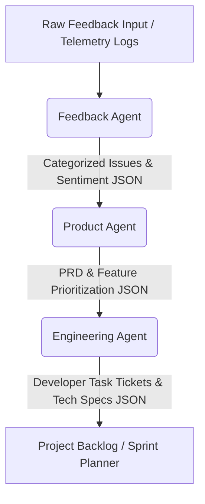

# BookFlix AI Operating System: Phase 1 Workflow Specification

**Location**: `/ai-system/workflows/phase1-workflow.md`  
**Pipeline**: Feedback Agent $\rightarrow$ Product Agent $\rightarrow$ Engineering Agent  
**Version**: 1.0.0  

---

## 1. Workflow Architecture
The Phase 1 workflow defines the core telemetry-to-task automation pipeline. It takes raw, unstructured user feedback (logs, reviews, support tickets) and processes it through a sequential multi-agent chain to produce actionable, structured engineering task tickets.



### Data Flow Overview
1. **Raw Logs Ingest**: Ingests raw text items from telemetry arrays.
2. **Analysis Report**: The **Feedback Agent** classifies logs and produces a structured category report.
3. **Requirement Mapping**: The **Product Agent** selects the most critical issue, designs feature requirements (PRD), and calculates backlog order.
4. **Task Decomposition**: The **Engineering Agent** maps changes to codebase files, drafts API adjustments, and formats Jira/GitHub developer tickets.

---

## 2. Execution Logic
The workflow operates as an automated state-machine loop managed by the Master Coordinator:

```
[Start]
   ↓
Fetch Raw Telemetry Logs
   ↓
Run FeedbackAgent (Analyze & Categorize)
   ↓
Is Sentiment Negative OR Bug Severity == High?
   ├── Yes: Fast-Track to Product PM Queue
   └── No: Standard Roadmap Queue
   ↓
Run ProductAgent (Draft PRD & Score RICE)
   ↓
Does PRD have valid acceptance criteria?
   ├── Yes: Hand off to Engineering Agent
   └── No: Corrective loop (Regenerate PRD)
   ↓
Run EngineeringAgent (Draft Tech Specs & Code Tasks)
   ↓
Do Task IDs compile / Lint checks pass?
   ├── Yes: Append to Backlog
   └── No: Trigger Failure Handler
   ↓
[Complete]
```

### Step-by-Step execution details:
* **Step 2.1 (Ingestion)**: The workflow queries the active telemetry file or database endpoint (e.g. `GET /api/admin/telemetry`).
* **Step 2.2 (Feedback Processing)**: Passes logs into the `FeedbackAgent.run()` method.
* **Step 2.3 (Product Decisioning)**: The coordinator parses the output, extracts high-impact UI/UX bugs, and pipes them directly to `ProductAgent.run()`.
* **Step 2.4 (Technical Specs Breakdown)**: Pushes the compiled PRD into `EngineeringAgent.run()`, which creates tasks containing step-by-step developer scripts.

---

## 3. Decision Trees

### A. Feedback Routing Decision Tree
```
                                 [Raw Feedback]
                                       |
                       Is it a crash or security leak?
                                    /     \
                               Yes /       \ No
                                  /         \
                      [Category: Bugs]    Calculate sentiment
                       Severity = High      score (-1.0 to +1.0)
                              |                   |
                     Route: Fast-Track      Is score < -0.4?
                     Product PM Queue      /                \
                                          / Yes              \ No
                                         /                    \
                               [Category: Bugs]      [Category: Feature/UI]
                               Severity = Medium       Roadmap Queue
```

### B. Roadmap Prioritization Decision Tree
```
                                 [Product Queue]
                                        |
                          Compute RICE score for each
                                        |
                            Are dependencies resolved?
                                     /    \
                                Yes /      \ No
                                   /        \
                            Push to Top   Deprioritize (Hold)
                             of Backlog      until unlocked
```

---

## 4. Failure Handling and Recovery Protocols

To guarantee production-grade stability under continuous automation, the pipeline implements three failure handling strategies:

| Failure Mode | Detection Indicator | Recovery Protocol |
| :--- | :--- | :--- |
| **LLM Output Corruption** | JSON parsing throws `JSONDecodeError` on sub-agent output. | **Corrective Retry**: Master Agent sends the invalid output back to the LLM with a schema reminder. Fails after 3 attempts. |
| **Database Concurrency Lock** | File writing throws `EBUSY` or `resource locked` during flat-file writes. | **Exponential Backoff**: Implementation of helper retries with jitter delays (50ms, 150ms, 450ms). |
| **API Provider Timeout** | Provider request throws status 503 or exceeds 15-second threshold. | **Mock Fallback**: Automatically switches active execution to standard local Rule-Based Heuristic templates. |

### Retry Execution Algorithm
```python
def safe_agent_call(agent, payload, retries=3):
    for attempt in range(retries):
        try:
            raw_response = agent.run(payload)
            # Validate JSON Structure
            return json.loads(raw_response)
        except (json.JSONDecodeError, Exception) as e:
            if attempt == retries - 1:
                # Log critical error to telemetry and alert human engineers
                write_system_alert(f"Agent {agent.name} failed after 3 retries. Error: {e}", "Critical")
                raise e
            # Modify payload with correction hint
            payload = f"CRITICAL SCHEMA ERROR: Your previous output was invalid. Return only valid JSON. Previous output: {raw_response}"
```
