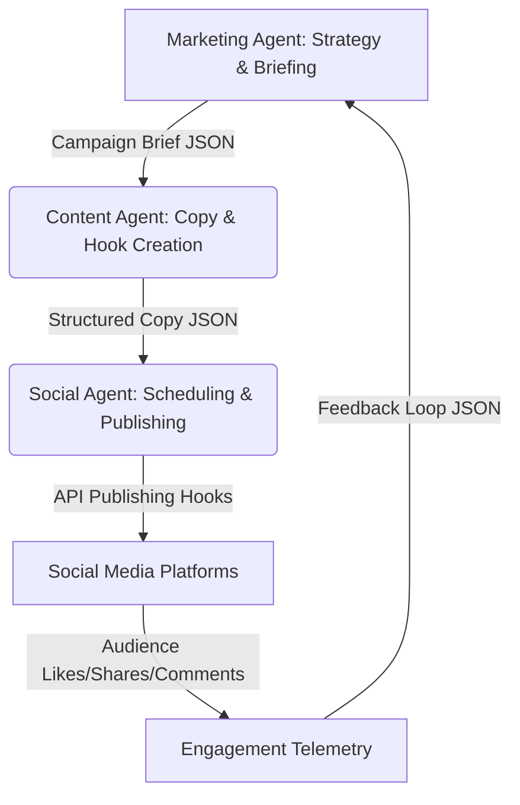

# BookFlix AI Operating System: Phase 2 Workflow Specification

**Location**: `/ai-system/workflows/phase2-workflow.md`  
**Pipeline**: Marketing Agent $\rightarrow$ Content Agent $\rightarrow$ Social Agent  
**Version**: 1.0.0  

---

## 1. Workflow Logic
The Phase 2 workflow automates the growth, customer acquisition, and marketing pipeline. It takes strategic parameters (budgets, goals, target cohorts) and converts them into viral media copy, schedules the posts across multi-platform APIs, and monitors user engagement stats to refine future campaigns.



### Data Pipeline Loops
1. **Strategy Loop**: The **Marketing Agent** evaluates active read logs, decides on a target cohort, calculates budget caps, and sends a campaign briefing.
2. **Creative Loop**: The **Content Agent** receives the briefing, brainstorms viral hooks, and generates custom copy for X, Instagram, TikTok, and WhatsApp.
3. **Distribution Loop**: The **Social Agent** ingests the copy assets, plans schedule slots, runs direct API updates, and polls engagement metrics (likes, views, click-throughs).
4. **Optimization Loop**: Engagement logs are analyzed and fed back into the Marketing Agent to re-allocate budgets to higher-converting channels.

---

## 2. Execution Steps

### Step 2.1: Campaign Strategy (Marketing Agent)
* **Action**: Ingests user reading trends and calculates customer lifetime value (LTV) compared to CAC.
* **Decision**: Formulates campaign goals, decides acquisition weights (e.g. 60% Meta, 40% X), and creates a campaign brief.

### Step 2.2: Content Creation (Content Agent)
* **Action**: Receives the brief and runs creative brainstorming routines.
* **Decision**: Drafts distinct copy variations, optimizes headlines, and ensures character counts stay within boundaries.

### Step 2.3: Publishing (Social Agent)
* **Action**: Retrieves content assets, populates the posting calendar, and executes automated publishing requests via REST APIs.
* **Decision**: Deploys posts at peak reading hours depending on target timezones.

### Step 2.4: Engagement Tracking (Social Agent $\rightarrow$ Analytics Agent)
* **Action**: Polls platform interaction hooks (retweets, comments, link clicks) after 24 hours.
* **Decision**: Flags posts with higher-than-average virality and writes log data to telemetry databases.

---

## 3. Decision Logic

The workflow relies on real-time execution branches and performance feedbacks:

### A. Channel Budgeting Decision Tree
```
                              [Start Campaign]
                                     |
                       Is target cohort Gen-Z / Mobile?
                                    /     \
                               Yes /       \ No
                                  /         \
                      Prioritize Instagram   Prioritize WhatsApp,
                      & TikTok (80% weight)  Email & X (80% weight)
```

### B. Post Scheduling Optimizer
```
                            [Post Scheduled]
                                   |
                       Is local user hour 8:00 AM,
                     12:30 PM, or 5:30 PM (commutes)?
                                  /     \
                             Yes /       \ No
                                /         \
                       Publish Instantly   Queue for next optimal
                                           transit time window
```

### C. Feedback Optimization Loop
```
                           [Poll Post Engagement]
                                     |
                       Is Link Click-Through-Rate > 3%?
                                    /     \
                               Yes /       \ No
                                  /         \
                       Log copy as 'Golden'  Adjust hook structure;
                       Scale ad spend x1.5   decrease ad budget by 20%
```
